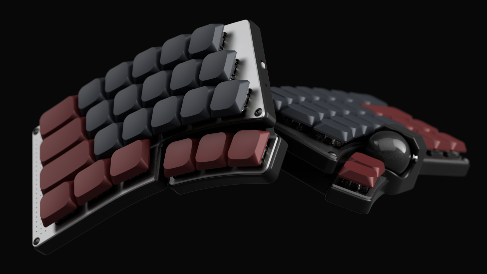

# Bifrǫst

Bifrǫst is a split-keyboard design project by [hringdrifi](https://github.com/hringdrifi).

It is a wireless keyboard design based on the MDBT50Q module, which uses the Nordic nRF52840 SoC.

## Project status

This keyboard is currently under active design. It is not yet a validated or production-ready design.

The case CAD files and PCB design files are published here. Firmware will be released as the project progresses.

## Available files

- [`case/`](case/README.md) — STEP files for the cases and switch plates
- [`pcb/`](pcb/) — KiCad sources for the five PCBs
- [`docs/manufacturing.md`](docs/manufacturing.md) — manufacturing reference ([日本語](docs/manufacturing.ja.md))

## License

The design data in `case/` and `pcb/` is licensed under the [CERN Open Hardware Licence Version 2 - Permissive (CERN-OHL-P-2.0)](LICENSE).

This license permits use, modification, manufacture, and sale of the design data and products made from it. Modified design data does not need to be published, but applicable notices must be retained and modifications must be documented. The design data and any resulting products are provided without warranty.

The CERN-OHL-P-2.0 license applies to the contents of `case/` and `pcb/`. Firmware will be released under the dual [MIT](https://spdx.org/licenses/MIT.html) OR [Apache-2.0](https://spdx.org/licenses/Apache-2.0.html) software license.

## Disclaimer

Verify dimensions, clearances, compatibility, manufacturability, and safety for your own build before making any parts. Use of these files is at your own risk.
